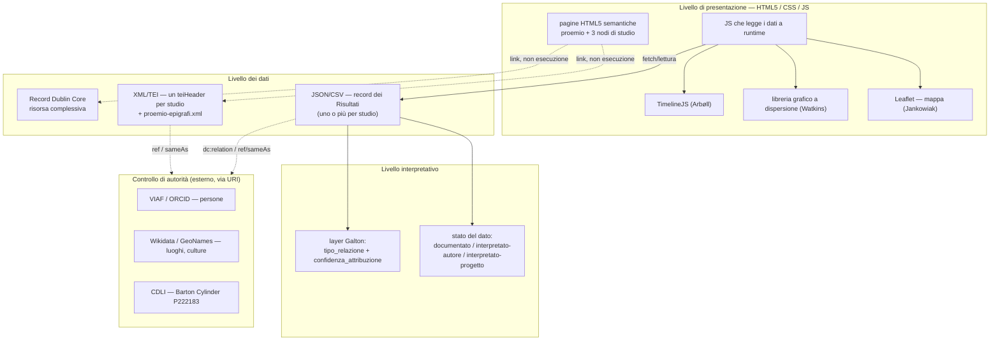

# Modello architetturale — bozza per slide di progettazione

Sito statico, nessun backend dinamico: scelta obbligata dal tempo (10 giorni) ma anche difendibile metodologicamente — i dati restano file leggibili e riusabili indipendentemente dal sito che li mostra, coerente con l'apertura richiesta dal modello a stelle di Berners-Lee.

## Come leggerlo a voce (in ordine)

1. **Il sito (HTML/CSS/JS) è solo la vetrina.** Non contiene dati: legge JSON/CSV a runtime per popolare le tre visualizzazioni, e linka (senza eseguirli) i file XML/TEI e il record DC per chi vuole vedere la codifica sottostante. Questo separa nettamente "dato" da "presentazione" — è la stessa logica per cui CollectionBuilder-GH è il riferimento tecnico più vicino al nostro caso, non un CMS con database.
2. **Due famiglie di file dati, non una.** Il teiHeader descrive lo *studio* (bibliografia, metodo — roba stabile, cambia raramente); il JSON/CSV descrive i *risultati* (i record che alimentano mappa/grafico/timeline — roba che potresti aggiornare se trovassi nuovi dati aggregati). Tenerli separati è anche una scelta pratica: eviti di dover toccare un file XML complesso ogni volta che aggiusti un valore sulla mappa.
3. **Il controllo di autorità non duplica dati, li collega.** VIAF/ORCID e Wikidata/GeoNames non sono copiati nei nostri file: sono URI esterni referenziati (`ref`/`sameAs` in TEI, `dc:relation` con `xsi:type="dcterms:URI"` in DC). Se un domani VIAF aggiorna un record, il nostro non si disallinea perché non ne possediamo una copia.
4. **Il livello interpretativo è nei Risultati, non nel teiHeader**, per il motivo già discusso: sono giudizi che riguardano singole osservazioni o relazioni fra osservazioni, non lo studio come pubblicazione.

## Nota tecnica in sospeso

Il controllo di autorità per Jankowiak/Volsche/Garcia (Watkins et al. e Arbøll/Rasmussen ancora da controllare) si sta rivelando più complicato del previsto: **VIAF copre soprattutto autori di monografie catalogate dalle biblioteche nazionali**, non autori di articoli scientifici — è plausibile che alcuni di questi ricercatori semplicemente non abbiano un record VIAF. In quel caso, l'alternativa corretta e altrettanto legittima (anche nel modello DC, tramite lo stesso pattern `xsi:type="dcterms:URI"`) è **ORCID**, lo standard proprio per l'identità dei ricercatori — probabilmente più adatto qui di VIAF. Sto verificando, ma i miei strumenti di ricerca automatica si stanno scontrando con blocchi anti-bot su viaf.org e con ORCID che richiede JavaScript per mostrare il profilo — quindi non ti do ID non confermati. Query pronte da incollare tu stessa/o (5 minuti, browser normale):
- viaf.org → cerca `Jankowiak, William`, `Volsche, Shelly`, `Garcia, Justin R.`
- orcid.org → cerca `Justin Garcia Kinsey Institute` (ho un candidato da confermare: **0000-0002-5198-4578** — verificalo tu perché io non sono riuscito a caricare la pagina per confermarlo), `William Jankowiak UNLV`, `Shelly Volsche Boise State`

Appena mi confermi gli ID (o mi dici che per qualcuno non esistono), aggiorno lo schema e passiamo al teiHeader.
